# Steelina Accessories Management System


A full-stack e-commerce and inventory management web application built with Flask, featuring customer shopping, authentication, and an administrative dashboard.
# Steelina Accessories Management System

A full-stack web application for managing an online accessories store, developed using **Python**, **Flask**, **SQLite**, **HTML**, **CSS**, and **JavaScript**.

The system allows customers to browse and purchase products while providing administrators with a dashboard to manage products, categories, customers, and orders.

---

## Features

### Customer Features

- User Registration and Login
- Secure Password Hashing
- Browse Products
- Product Details Page
- Search Products
- Filter by Category
- Shopping Cart
- Wishlist
- Checkout System
- Customer Profile Management
- About Page
- Contact Page
- Responsive Design
- Dark Mode

### Admin Features

- Secure Admin Login
- Dashboard Statistics
- Product Management (CRUD)
- Category Management (CRUD)
- Customer Management
- Order Management
- Update Order Status

---

## Technologies Used

- Python 3
- Flask
- SQLite
- HTML5
- CSS3
- JavaScript
- Jinja2

---

## Project Structure

```text
steelina-accessories-management-system/
│
├── app/
│   ├── routes/
│   ├── templates/
│   ├── static/
│   └── utils/
│
├── database/
│   └── store.db
│
├── docs/
├── config.py
├── run.py
├── requirements.txt
├── README.md
└── .gitignore
```

---

## Installation

1. Clone the repository

```bash
git clone https://github.com/YOUR_USERNAME/steelina-accessories-management-system.git
```

2. Navigate into the project

```bash
cd steelina-accessories-management-system
```

3. Install dependencies

```bash
pip install -r requirements.txt
```

4. Run the application

```bash
python run.py
```

5. Open your browser

```
http://127.0.0.1:5000
```

---

## Screenshots

### Home

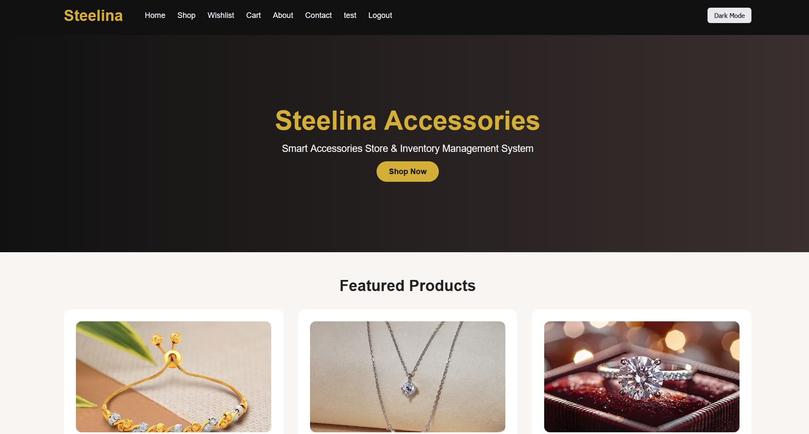

---

### Shop

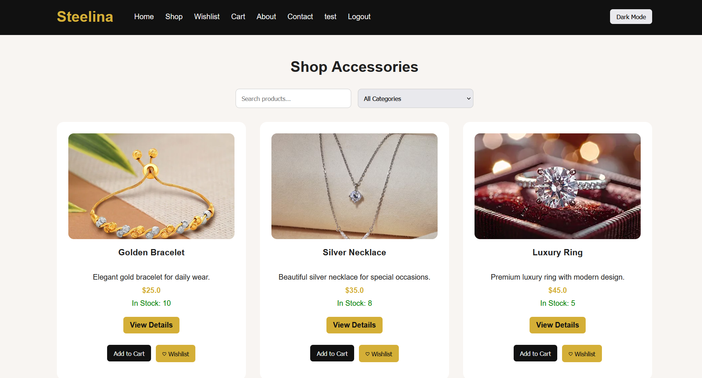

---

### Product Details

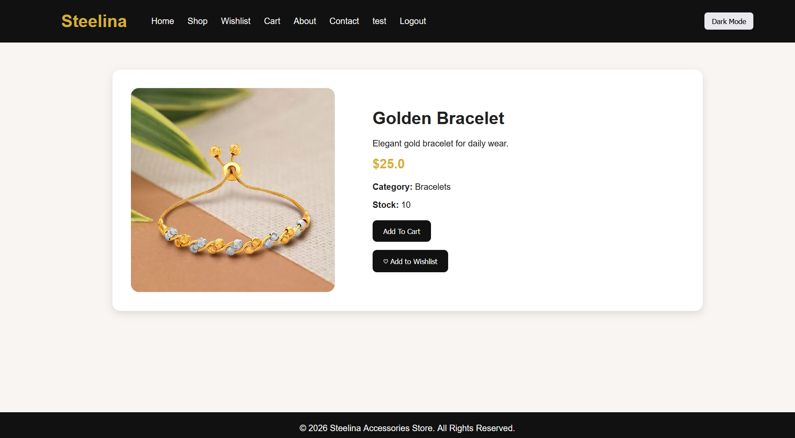

---

### Cart

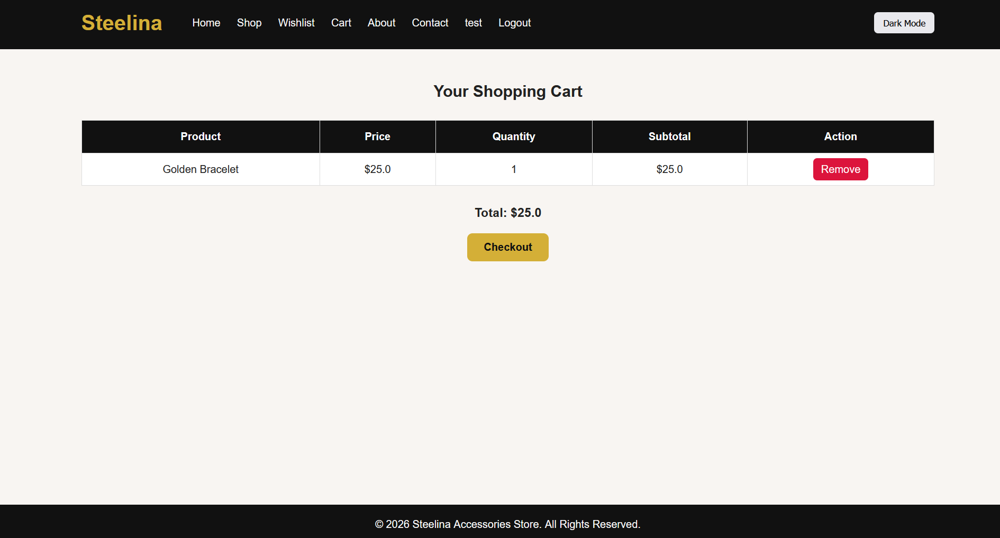

---

### Wishlist

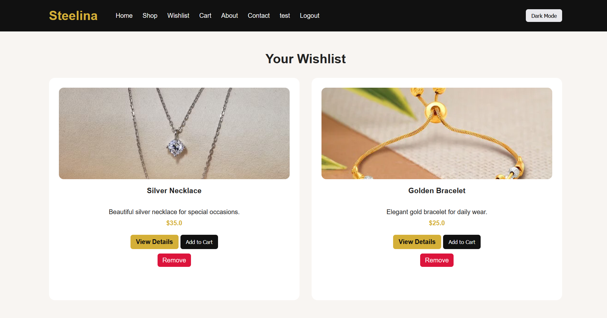

---

### Checkout

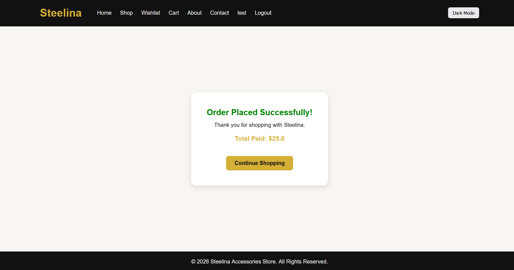

---

### Profile

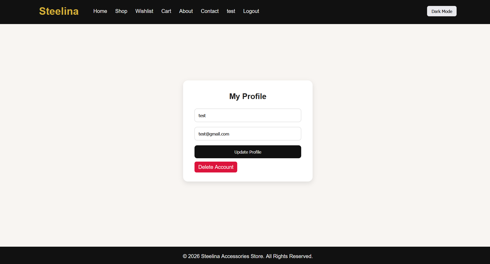

---

### Admin Dashboard

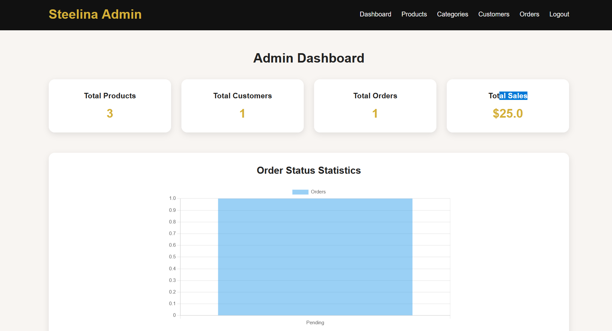

---

### Admin Products

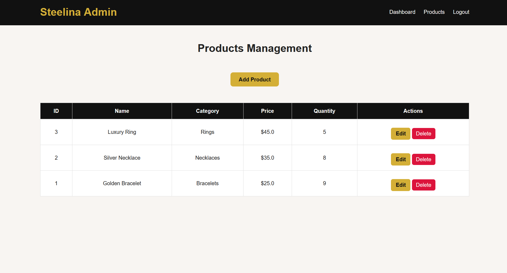

---

### Admin Categories

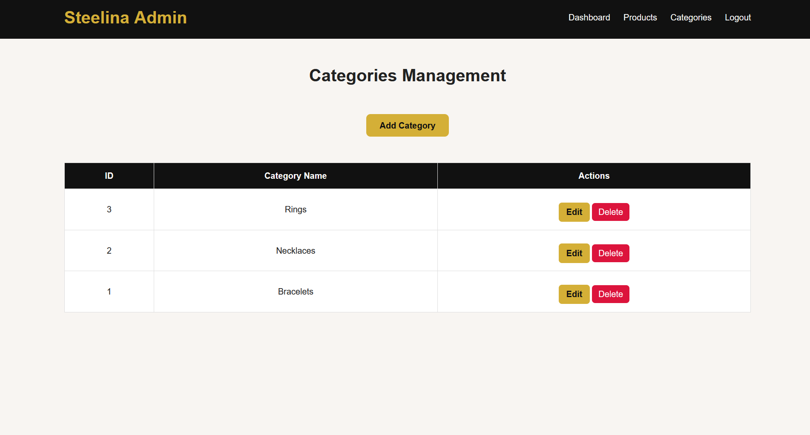

---

### Admin Customers

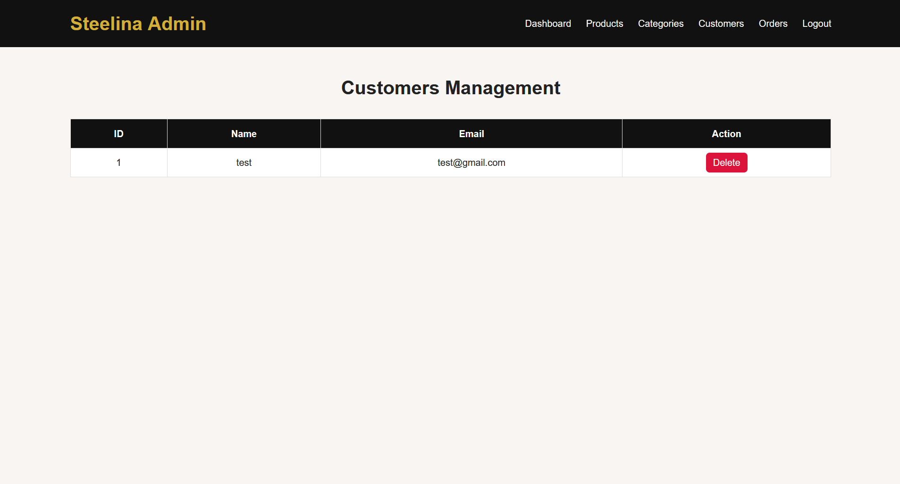

---

### Admin Orders

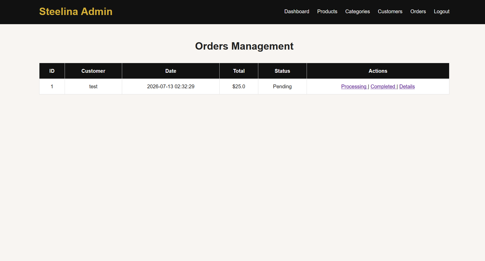

---

## Future Improvements

- Product image upload
- Email confirmation
- Payment gateway integration
- Sales reports
- Product reviews and ratings
- Inventory alerts
- Responsive admin dashboard

---

## Author

**Mohammad**

# Steelina Accessories Management System

Steelina is a full-stack e-commerce and inventory management web application built with Flask. It provides customers with an online shopping experience while allowing administrators to manage products, categories, customers, and orders through a dedicated dashboard.
